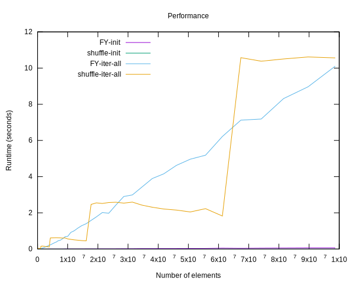

shuffle
========

A pseudo random permutation generator for array indices — in plain terms, an algorithm to iterate
over a fixed sized array in pseudo random fashion visiting each element exactly once.

Map a set of n integers to another set of n integers in a pseudo random fashion: `[0..n-1]` → `[0..n-1]`


Usage
-----

This is a single-file library so just include the header where needed and specify one file that the implementation resides in:
```c
#define SHUFFLE_IMPLEMENTATION
#include "shuffle.h"
```

Then just create and initialize a shuffle context:
```c
struct shuffle_ctx ctx;
shuffle_init(&ctx, size, 0xBAD5EEED);
```

And iterate over your data using the random index:
```c
shuffle_index(&ctx, i);
```

Reseed:
```c
shuffle_reseed(&ctx, 0xBAAD5EED);
```

You can also get the original index by running:
```c
shuffle_index_invert(&ctx, ri);
```

Example
-------

Full example, see included [example.c](example.c).


```c
#include <stdio.h>

#define SHUFFLE_IMPLEMENTATION
#include "shuffle.h"

int
main (void)
{
	char* list[] = {
		"The",
		"quick,",
		"brown",
		"fox",
		"jumped",
		"over",
		"the",
		"fence",
		"and",
		"was",
		"never",
		"to",
		"be",
		"seen",
		"again.",
	};

	size_t size = sizeof(list)/sizeof(list[0]);

	struct shuffle_ctx ctx;
	shuffle_init(&ctx, size, 0xBAD5EEED);

	size_t i, j, k;
	for (i = 0; i < size; ++i) {
		j = shuffle_index(&ctx, i);
		k = shuffle_index_invert(&ctx, j);
		printf("%2zu %6s   %2zu %6s\n", j, list[j], k, list[k]);
	}

	return 0;
}

```

Which will output:
```
 3    fox    0    The
14 again.    1 quick,
13   seen    2  brown
 9    was    3    fox
10  never    4 jumped
 7  fence    5   over
 8    and    6    the
12     be    7  fence
 5   over    8    and
 4 jumped    9    was
11     to   10  never
 6    the   11     to
 0    The   12     be
 1 quick,   13   seen
 2  brown   14 again.
```

Rationale
---------

Why not use the classic Fisher-Yates (FY) algorithm to create a pseudo random permutation?

Fisher-Yates comes with several constraints: Your data has to be either mutable or you need a ton of extra space.

A full comparison of constraints and complexities can be found in the following table:

|                                 | Classic FY | Inside-out FY | shuffle  |
|---------------------------------|------------|---------------|----------|
| Needs mutable data              | Y          | N             | N        |
| Memory                          | O(1)       | O(n)          | O(1)     |
| Runtime                         | O(n)       | O(n)          | O(n)     |
| Runtime to access first element | O(1)       | O(n)          | O(1)     |


Implementation Details
----------------------

**DISCLAIMER: THIS ALGORITHM IS NOT CRYPTOGRAPHICALLY SECURE!**

This algorithm uses format preserving encryption to encrypt (or decrypt) indices.

It does so by using a variable bit block cipher, implemented through a symmetric Feistel network with cyclic walking to ensure the output is within the specified domain.

The average cycle walking distance is 4.

The round function is a very simple 2 pass xorshift-multiply-xorshift hash function.

Key derivation is done by using a sliding window to extract a few bits each round from the provided seed.

Performance
-----------

### Randomness ###

So how random is shuffle? While this might be somewhat difficult to answer, there is a
Pearson's Chi-squared test included in this repository to check for yourself.

| Arch   | P-Value |
|--------|---------|
| 32-bit | 0.3083  |
| 64-bit | 0.2255  |

Both p-values are greater than the typical threshold of 0.05 which suggests the results
are independent! Be aware that these results vary depending on the input size.

### Speed ###



Interestingly shuffle seems to outperform the classic Fisher-Yates algorithm depending on
input size. While the run time for Fisher-Yates increases linearly, the run time for the
shuffle algorithm increases in steps. This highlights the nature of the underlying block
cipher quite nicely.

#### System Under Test ####

```
Intel(R) Core(TM) i7-8650U CPU @ 1.90GHz
32GiB Memory

Linux 5.4.42-1-lts x86_64
glibc 2.31-4

```

License
-------

ISC license, see [LICENSE](LICENSE).

